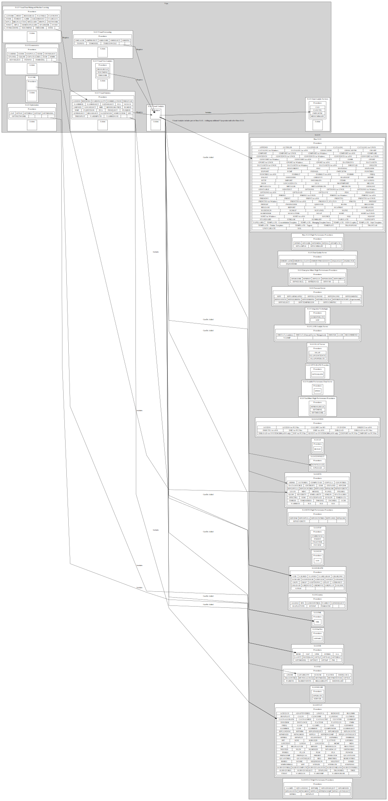

# What Is SAS?
 An overview of platforms, runtimes, products, procedures (proc's) and actions (Viya/CASL).  Created with Python, GraphViz, Selenium, and WD-40!

# Goals
Provide an interactive visual guide the all of SAS for coding in SAS 9.4, SAS Viya Procedures, SAS Viya Actions including using through opensource API's.

# Current Prototype

# TODO
- [X] Collect Data
  - [X] Build a series of web crawlers to discover and collect information about all SAS products and their relationships
- [X] Process Data
  - [X] Prepare the collect data for visual presentation
- [ ] Graph Data with Graphviz
  - [ ] A hierarchy of visual to allow discovery and navigation of SAS platforms, products, procedures, and actions

# Current Work
- [X] complete crawlers
  - [X] procs_by_product: procs
  - [X] procs_by_product: procs_plus
  - [X] procs_by_product: procs_linked
  - [X] in each crawler write a subfunction for writing csv files (like the reader function)
  - [X] update reader and writer function with header parameter created in process
- [X] rewrite the process file against new file structure
  - [X] viya_procs has some sas 9 products listed (VS has SAS/STAT)
- [X] move common functions to a common/commons.py file and import throughout modules: myreader, mywriter
- [ ] tie exisitng graphs to new data structure
  - [ ] graph for platform + products
  - [ ] graph for platform + products + procedures/actionSets
    - [ ] version with relationships added
- [X] delete "dump this" and "testing stuff" - consolidated into testing stuff
