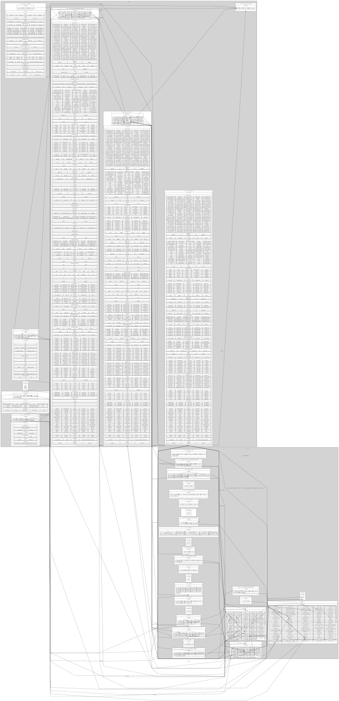

# What Is SAS?
 An overview of platforms, runtimes, products, procedures (proc's) and actions (Viya/CASL).  Created with Python, GraphViz, Selenium, and WD-40!

# Goals
Provide an interactive visual guide the all of SAS for coding in SAS 9.4, SAS Viya Procedures, SAS Viya Actions including using through opensource API's.

# Current Prototype (very early)

# TODO
- [X] Collect Data
  - [X] Build a series of web crawlers to discover and collect information about all SAS products and their relationships
- [X] Process Data
  - [X] Prepare the collect data for visual presentation
- [X] Graph Data with Graphviz
  - [ ] A hierarchy of visuals to allow discovery and navigation of SAS platforms, products, procedures, and actions

# Current Work
- [X] complete crawlers
  - [X] procs_by_product: procs
  - [X] procs_by_product: procs_plus
  - [X] procs_by_product: procs_linked
  - [X] in each crawler write a subfunction for writing csv files (like the reader function)
  - [X] update reader and writer function with header parameter created in process
- [X] rewrite the process file against new file structure
  - [X] viya_procs has some sas 9 products listed (VS has SAS/STAT)
- [X] move common functions to a common/commons.py file and import throughout modules: myreader, mywriter
- [X] tie existing graphs to new data structure
- [X] delete "dump this" and "testing stuff" - consolidated into testing stuff
- [ ] complete prototype of overall - too big and very busy BUT complete
  - [ ] engineer out the need for special coding for SAS Visual Analytics and SAS IML
  - [ ] separate sas 9 platform into:
    - [ ] on Viya - a cluster inside Viya
    - [ ] not on Viya - a cluster outside Viya
  - [X] add actionSets
    - [X] add actions as nested table beneath each actionset
    - [X] removed actionsets that add no actions listed: nmf in VS and VDMML
    - [ ] deal with duplicate names of actionsets across products and actions with same name as actionset - is this needed or does product > port=actionset:action enough?
  - [ ] figure out borders: product > proc / actions > items > nested table items (actions)
  - [ ] add hyperlinks:
    - [ ] names of products
    - [ ] list of procs / actionsets / actions
    - [X] names of procs / actionsets / actions
    - [X] figure out escape characters: escaping & with &amp; in hyperlinks but dot.render strips this in href=, using import re to modify the .svg to re-escape &.  Not beautifulsoup because it auto-escsapes on read with lxml... and resolves with xml 
  - [ ] color coding
    - [ ] action/actionset/proc cas enabled = viya green
    - [ ] proc on 9.4 workspace only = sas blue
    - [ ] proc on both = yellow
  - [ ] link related procs
    - [ ] add hyperlinks to edges
  - clean up code
    - [ ] make functions for table and cluster building - partially started
    - [ ] add "_input" to all lists of read in data sources to prevent confusion with created list throughout code
- [ ] use the completed prototype to break down into layers with hyperlinks to drill through:
  - [ ] Platforms & products
    - [ ] select product: procs & actionsets+actions
      - [ ] select proc/actionset/action:
        - [ ] see relationships to other procs - or - go to manual for that item

# Longterm Goals
- [ ] create a what's new history for every element
- [ ] get proc descriptions for link hover text
